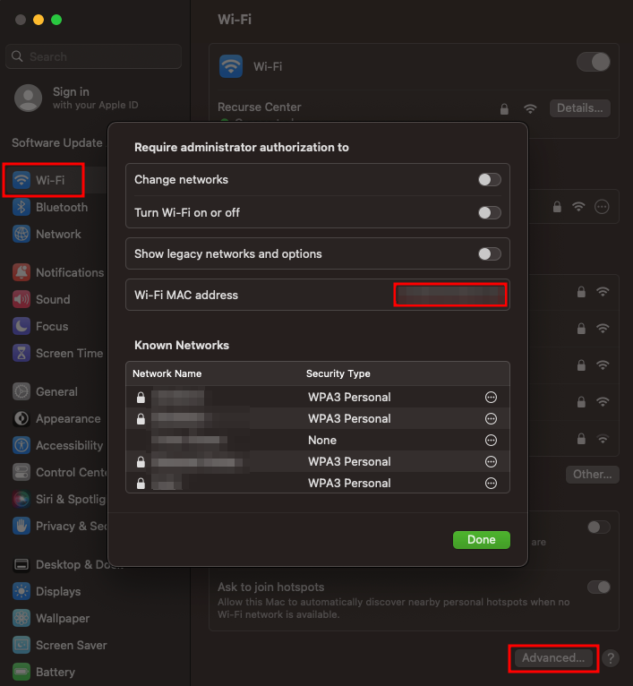

# V.A.L.E.T.

_VisitAPI Automation & Location Estimation Terminal_

V.A.L.E.T. serves to automate checking into the RC Hub when you walk in. It does this by reading WiFi packets
that every device sends out when it connects to the Recurse Center WiFi network. If it sees any packets that were sent
by a device whose [MAC Address](https://en.wikipedia.org/wiki/MAC_address) has been registered with it, it uses
the [Hub Visits API](https://github.com/recursecenter/wiki/wiki/Recurse-Center-API#hub-visits) to create a new visit
for the corresponding RCer.

---

### How to find your device's MAC Address

#### iPhone

1. Allow V.A.L.E.T. to recognize your phone on the Recurse Center WiFi by turning off 'Private WiFi Address' for the RC network using [these instructions](https://support.apple.com/en-us/HT211227#onoff).
   > 

   > 
More info

   > iPhones use a feature called <a href="https://support.apple.com/en-us/HT211227">Private WiFi Addresses</a> to randomize their MAC Address when they connect to a WiFi Network. Because V.A.L.E.T. uses MAC Addresses to detect when a device connects to the RC network this feature has to be turned off for the RC network. You can keep it on for every other WiFi network you connect to.
   > 

1. Go to `Settings`
1. Then `General`
1. Then `About`
1. Your MAC Address will be labeled `Wi-Fi Address`

#### Android

1. Allow V.A.L.E.T. to recognize your phone on the Recurse Center WiFi by turning off 'MAC Randomization' for the RC network using [these instructions](https://www.howtogeek.com/722653/how-to-disable-random-wi-fi-mac-address-on-android/).
   > 

   > 
More info

   > Androids use a feature called <a href="https://source.android.com/docs/core/connect/wifi-mac-randomization-behavior">MAC Randomization</a> to randomize their MAC Address when they connect to a WiFi Network. Because V.A.L.E.T. uses MAC Addresses to detect when a device connects to the RC network this feature has to be turned off for the RC network. You can keep it on for every other WiFi network you connect to.
   > 

1. Scroll down on the same network settings page from step 1
1. Your MAC address will be labeled `Device MAC address`

#### Mac (Apple Laptop)

1. Open `System Settings`
1. Click on the `WiFi` tab
1. Scroll to the bottom and click `Advanced...`
1. Your MAC Address will be labeled `Wi-Fi MAC Address`
   > 

   > 
Screenshot

   > 
   > 

